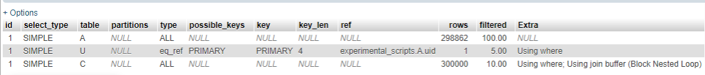
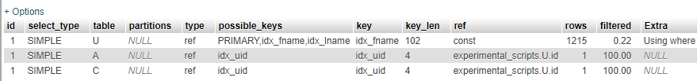

# MariaDB

- `index.php` - connect with mariadb
- Use `adminer.php` to connect to GUI
- - HOST *localhost:3307*
- - DB *maria_db_demo*

### Reference

- https://mariadb.com/kb/en/installing-mariadb-msi-packages-on-windows/ (Depend on OS)
- `my-mariadb-db.sql`

---

# MySQL

## Index / Explain statement

- Index works best on those columns that are the subject of the **WHERE** clauses
- TEXT / BLOB - Does not normally have lenght value, therefore cannot be indexed as it cannot guarantee uniqueness. use VARCHAR
- `experimental_scripts.sql` - located *http://iox.000webhostapp.com/sql/experimental_scripts.sql*
- <pre>SELECT * FROM `addresses` AS A INNER JOIN `cards` AS C INNER JOIN `users` AS U WHERE A.uid = U.id AND C.uid = U.id AND U.fname = 'Stacey' AND U.lname = 'Predovic'</pre>
- **No indexing** - Showing rows 0 - 24 (35 total, Query took **85.7867** seconds.)
- **Indexing** - Showing rows 0 - 24 (35 total, Query took **0.9479** seconds.)
- Adding Index to tables
- - > CREATE INDEX idx_fname ON users (`fname`);
- - > CREATE INDEX idx_lname ON users (`lname`);
- - > CREATE INDEX idx_uid ON addresses (`uid`);
- - > CREATE INDEX idx_uid ON cards (`uid`);
- Difference with **EXPLAIN** Statement
- - Before Indexing
- - 
- - After Indexing
- - 

---

# Notes (Git LFS - large file storage)

- Run `git lfs install`
- create `.gitattributes`
- Run `git lfs track '*.sql'` - Tracking all *.sql* files
- Run `git add .gitattributes`